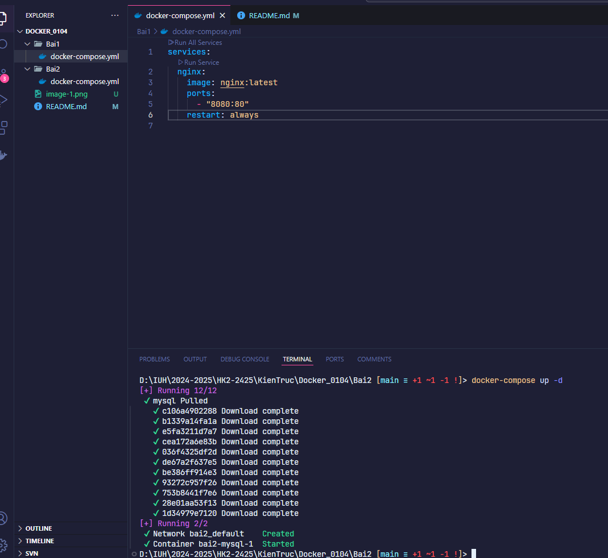

# Ho ten: Nguyen Tan Loc
# MSSV: 21059391

## Bài 1: Chạy Nginx với Docker Compose
`docker-compose up -d`

#### Chạy trên localhost:8080

## Bài 2: Chạy MySQL với Docker Compose
`docker-compose up -d`

## Bài 3: Kết nối MySQL với PHPMyAdmin
`docker-compose up -d`

#### Chạy trên localhost:8081

## Bài 4: Chạy ứng dụng Node.js với Docker Compose

#### Chạy trên localhost:3000
